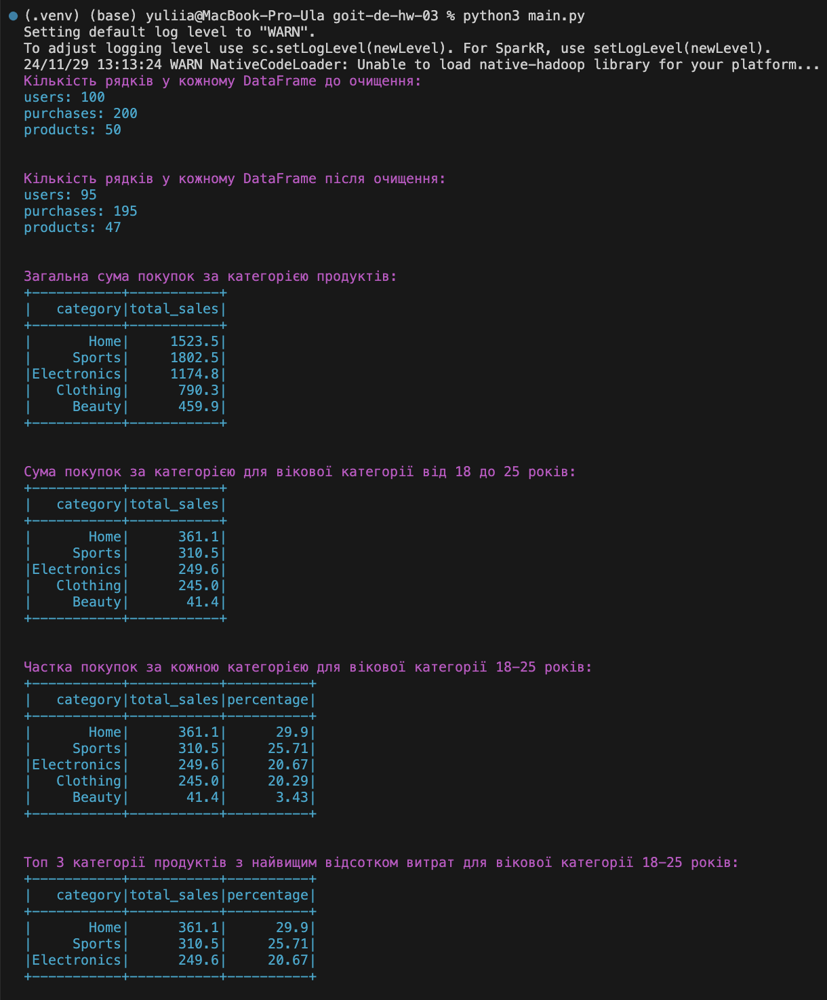

# Домашнє завдання. Аналіз даних у PySpark

Вітаю в першому домашньому завданні! 🙂

Сьогодні ви будете виконувати різноманітні операції обробки даних у Spark, а
також розвивати свої аналітичні здібності й навички програмування.

Це завдання допоможе вам засвоїти основні концепції та синтаксис роботи з Apache
Spark, та навчитися використовувати ці знання на практиці для обробки даних.

У вас усе вийде! 💪🏼

## Початкові дані

Ви працюватимете з трьома вхідними CSV-файлами:

1. users.csv — дані користувачів:

- `user_id` (унікальний ідентифікатор користувача)
- `name` (ім'я користувача)
- `age` (вік користувача)
- `email` (електронна адреса)

2. purchases.csv — дані про покупки:

- `purchase_id` (унікальний ідентифікатор покупки)
- `user_id` (ідентифікатор користувача, який зробив покупку)
- `product_id` (унікальний ідентифікатор продукту)
- `date` (дата покупки)
- `quantity` (кількість одиниць купленого товару)

3. products.csv — інформація про продукти:

- `product_id` (унікальний ідентифікатор продукту)
- `product_name` (назва продукту)
- `category` (категорія продукту)
- `price` (ціна одиниці товару)

## Покрокова інструкція виконання

1. Завантажте та прочитайте кожен CSV-файл як окремий DataFrame.

2. Очистіть дані, видаляючи будь-які рядки з пропущеними значеннями.

3. Визначте загальну суму покупок за кожною категорією продуктів.

4. Визначте суму покупок за кожною категорією продуктів для вікової категорії
   від 18 до 25 включно.

5. Визначте частку покупок за кожною категорією товарів від сумарних витрат для
   вікової категорії від 18 до 25 років.

6. Виберіть 3 категорії продуктів з найвищим відсотком витрат споживачами віком
   від 18 до 25 років.

> [!IMPORTANT]
>
> 💡 Відсоток потрібно округлити до другого знака після коми.

## Критерії прийняття та оцінювання ДЗ

Написання усіх 6 запитів відповідно до заданих умов виконання. Запити мають
виконуватися й давати очікуваний результат.

> [!TIP]
>
> ☝🏻 Критерії прийняття домашнього завдання є обов’язковою умовою оцінювання
> домашнього завдання ментором. Якщо критерії не виконано, ДЗ відправляється
> ментором на доопрацювання без оцінювання. Якщо вам «тільки уточнити»😉 або ви
> «застопорилися» на якомусь з етапів виконання — звертайтеся до ментора у
> Slack).

### Загальна максимальна кількість балів — 100:

- Етап 1 оцінюється в 10 балів.
- Етап 2 оцінюється в 10 балів.
- Етап 3 оцінюється у 20 балів.
- Етап 4 оцінюється у 25 балів.
- Етап 5 оцінюється у 25 балів.
- Етап 6 оцінюється в 10 балів.

> [!WARNING]
>
> ! Якщо є помилки чи недоліки виконання, кількість балів на кожному етапі
> зменшується пропорційно до наявних помилок на розсуд ментора.

> [!CAUTION]
>
> ☝🏻 УВАГА!! У вас є можливість обрати підхід до виконання та можливого
> доопрацювання домашнього завдання:
>
> 1. задовольнитися першою отриманою оцінкою (звісно ж, якщо вона вище
>    прохідного бала),
> 2. намагатися отримати вищий бал шляхом можливого послідуючого доопрацювання
>    роботи у відповідності з фідбеком ментора. Обраний підхід до виконання ДЗ
>    необхідно зазначити у полі для здачі до прикріпленого завдання. За
>    відсутності коментаря ментор дотримується першого підходу й виставляє
>    отриману оцінку.

> [!NOTE]
>
> 💡 Відправляйте ДЗ на перевірку, коли зроблено все можливе, оскільки кількість
> спроб здачі завдання впливає на отриманий бал! За кожну наступну спробу після
> другої (тобто з третьої) максимально можлива кількість балів зменшується на 5.
>
> Таким чином:
>
> - 1 спроба: максимальна кількість балів – 100,
> - 2 спроба: максимальна кількість балів – 100,
> - 3 спроба: максимальна кількість балів – 95,
> - 4 спроба: максимальна кількість балів – 90,
> - 5 спроба: максимальна кількість балів – 85, тощо
>
> Критерії оцінювання робіт у магістратурі GoIt Neoversity

## Підготовка й завантаження домашнього завдання

1. Створіть публічний репозиторій `goit-de-hw-03`.

2. Виконайте завдання та відправте у свій репозиторій код та скриншоти
   візуалізації Spark-датафреймів (`df.show()`).

> [!IMPORTANT]
>
> 💡 ВАЖЛИВО Будь ласка, пронумеровуйте скриншоти, щоб менторам було зрозуміло,
> до якого етапу ДЗ відноситься кожний з них. Наприклад, якщо файл відноситься
> до пункту 3, то назва файла має починатися так: p3\*.

3. Збережені на вашому комп’ютері скриншоти візуалізації Spark-датафреймів
   (`df.show()`) також прикріпіть в LMS архівом. Назва архіву повинна бути у
   форматі ДЗ3\*ПІБ.

4. Прикріпіть посилання на репозиторій `goit-de-hw-03`` і відправте на
   перевірку.

## Формат здачі

- Посилання на репозиторій `goit-de-hw-03`.
- Прикріплений архів із назвою ДЗ3_ПІБ.

### Результат виконаного завдання

